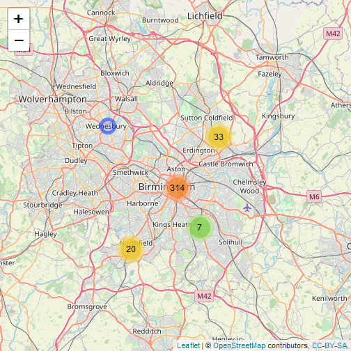

<style>
.title-slide {
  background-color: #FFFFFF; /* #EDE0CF; ; #CA9F9D*/
code.r{
  font-size: 10px;
}
</style>


## Displaying road collision data in the UK
<br /> 
<https://mbcmn.shinyapps.io/assignment>  
<br /> 

This shiny app displays road collisions in the UK as recorded in the STATS19 dataset provided by the Department for Transport.<br />  
Road collision data is vital for transport planning and road safety work, but the raw data is provided in a not very accessible way.<br />  
This app allows to quickly display road collision data for a selected area of interest.<br />

---


## What the app does


The user selects the following from the sidebar boxes:
  
  * Year (2015 - 2018)
  * Accident severity: Fatal/Serious/Slight
  * Local authority (the area of interest)

Then, the app queries the accident data, filters according to the user input and displays the data on a map using leaflet. The code deployed in the app is shown on the next slide, with added reactive event wrappers, UI and dynamic inputs instead of hard-coded values.

Leaflet is then used to display the accident data on a map, with popups providing the following, additional information on the road collision, such as:  

Accident severity / Date / Vehicles involved /  Number of casualties / Speed limit on the road


---


## The code 


    

```r
crashes <- get_stats19(year = 2017, type = "Accidents", ask = FALSE) %>%
  filter(local_authority_district == 'Birmingham') %>%
  filter(accident_severity %in% c("Serious")) %>%
  filter((longitude != is.na(longitude)) & (latitude != is.na(latitude))) %>%
  mutate(accident_severity = factor(accident_severity))

crash_map <- leaflet() %>%
  addTiles() %>%
  addCircleMarkers(data = crashes, clusterOptions = markerClusterOptions(),
                   lng = ~longitude, lat = ~latitude,
                   popup = paste("<b>", crashes$accident_index,"</b>","<br>",
                                 "Severity:", crashes$accident_severity, "<br>",
                                 "Date:", crashes$date, "<br>",
                                 "Vehicles involved:", crashes$number_of_vehicles,"<br>",
                                 "Number of casualties:", crashes$number_of_casualties,"<br>",
                                 "Speed limit:", crashes$speed_limit,"mph","<br>"),
                   )
```


---


## What the user gets:





---


## Stats19 package

Besides shiny, leaflet and dplyr, the app makes use of the Stats19 package, developed to download, display and process official road collision data for the UK in an easier and more efficient way in R. For more information, please read the vignette:    
<https://cran.r-project.org/web/packages/stats19/vignettes/stats19.html>
<br />
<br />  
<br />  
## Thank you


